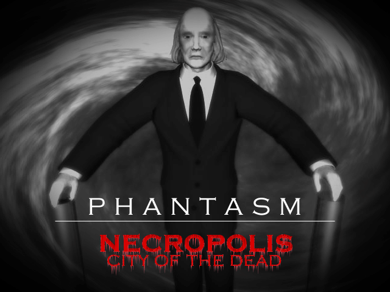

# Necropolis - City of the Dead

Created in 2000 by Mavrick Designs, "Necropolis" is a horror game based on the movie Phantasm (1979).
It was developed in DarkBASIC and published as Freeware on some DarkBASIC Demo CDs.

In 2025, I have ported the game to DarkBASIC Professional and fixed a BUNCH of bugs and problems,
and also implemented some small improvements, such as showing the current level in the HUD
and implementing a launcher to choose the screen resolution and window mode.

## Let's play

see [Let's play of Necropolis](https://youtu.be/hPutTdCUgAk)

## How to play

### Download and Installation

- Download Necropolis and DirectX 9.0c here: https://github.com/danielmarschall/necropolis/releases
- Install DirectX 9.0c (you need this even if you have a newer version of DirectX installed). If Windows requests to install .Net Framework, accept that too.
- After everything is installed, you just need to run NecropolisLauncher.exe to play the game

### Instructions

At the first level, you need to shoot enemies until one enemy drops the key. Then you can enter the house (enter at the window shown in the intro video).

In the next levels, you need to find the key (which is always on the floor) and go through the door in the spacegate room.

Beginning with level 4, spheres will follow you. The silver spheres (level 4-7) are slow, the golden ones (level 8-11) are faster and the read ones (level >=12) are deadly and fast. Note that you can shoot them.

### Controls

- Walk with the arrow keys
- Shoot with the Ctrl key
- Escape key closes the game

### Items

- Ammo
- Shield
- Life
- Key

### Radar

If you have shot 60 enemies, then you receive a radar at the next stage. It will show everything around you, but no spheres.

At 80 enemies, the radar will also show silver and golden spheres

At 120 enemies, the radar will show the whole map, not just the area around you.

At 140 enemies, the radar will also show the red spheres.

At the right top you can see the amount of enemies killed. Note that the counter does not reset when you restart after dying.

## Development

To compile and/or modify the game yourself, you need the following tools:

- DarkBASIC Professional (for the game itself): Free version available at https://github.com/Dark-Basic-Software-Limited/Dark-Basic-Pro/releases/tag/12.02.16

- Embarcadero Delphi (for the Launcher only): Free version available at https://www.embarcadero.com/de/products/delphi/starter (non-commercial use only)

## License

Freeware / Abandonware
